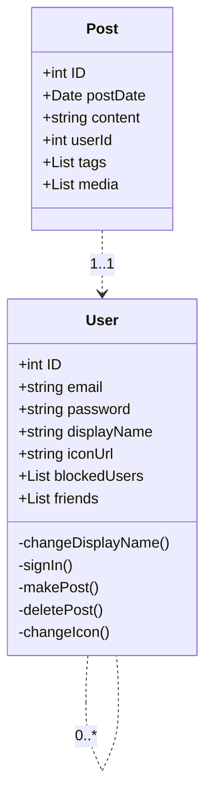

```mermaid
classDiagram
	User : +int ID
	User : +string email
	User : +string password
	User : +string displayName
	User : +string iconUrl
	User : +List blockedUsers
	User : +List friends
	User : -changeDisplayName()
	User : -signIn()
	User : -makePost()
	User : -deletePost()
	User : -changeIcon()

	Post : +int ID
	Post : +Date postDate
	Post : +string content
	Post : +int userId
	Post : +List tags
	Post : +List media 

	Post ..> User : 1..1
	User .. User : 0..*
	User .. User : 0..*
```