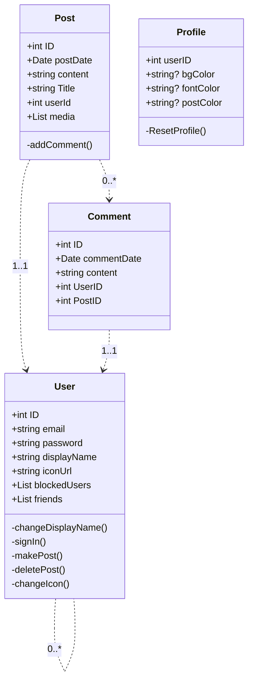

```mermaid
classDiagram
	User : +int ID
	User : +string email
	User : +string password
	User : +string displayName
	User : +string iconUrl
	User : +List blockedUsers
	User : +List friends
	User : -changeDisplayName()
	User : -signIn()
	User : -makePost()
	User : -deletePost()
	User : -changeIcon()

	Post : +int ID
	Post : +Date postDate
	Post : +string content
	Post : +string Title
	Post : +int userId
	Post : +List media 
	Post : -addComment()

	Comment : +int ID
	Comment : +Date commentDate
	Comment : +string content
	Comment : +int UserID
	Comment : +int PostID
	
	Profile : +int userID
	Profile : +string? bgColor
	Profile : +string? fontColor
	Profile : +string? postColor
	Profile : -ResetProfile()

	Post ..> User : 1..1
	Comment ..> User : 1..1
	Post ..> Comment : 0..*
	User .. User : 0..*
	User .. User : 0..*
	
```